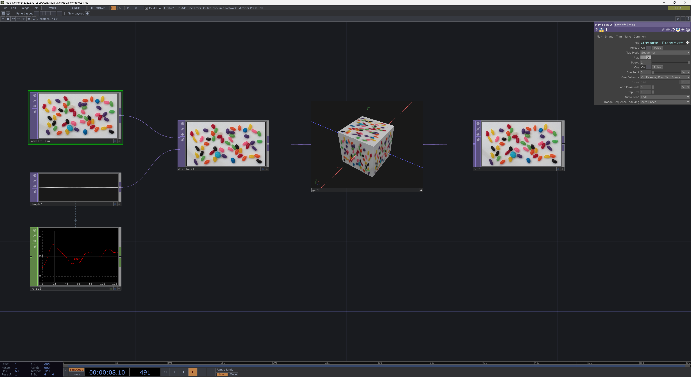
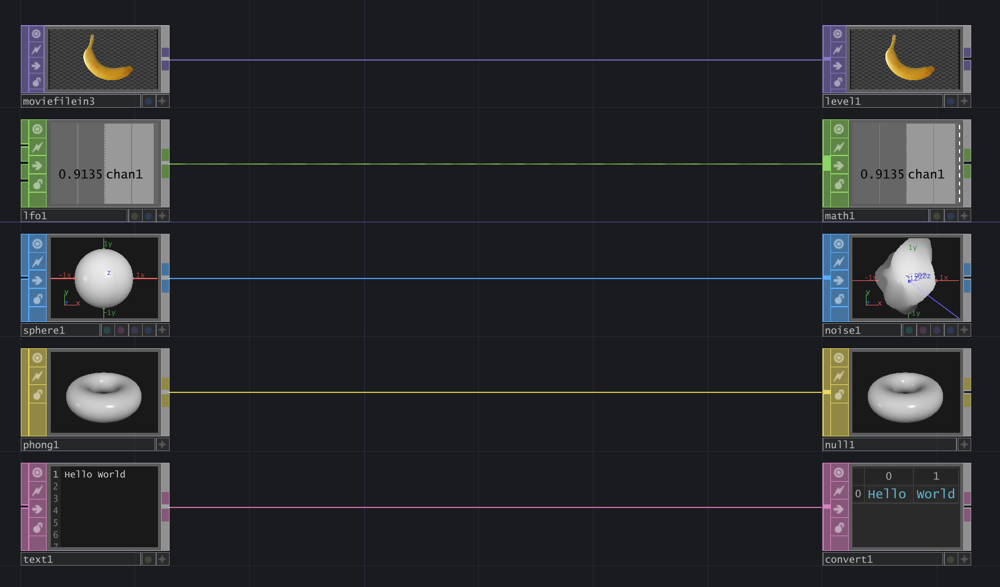
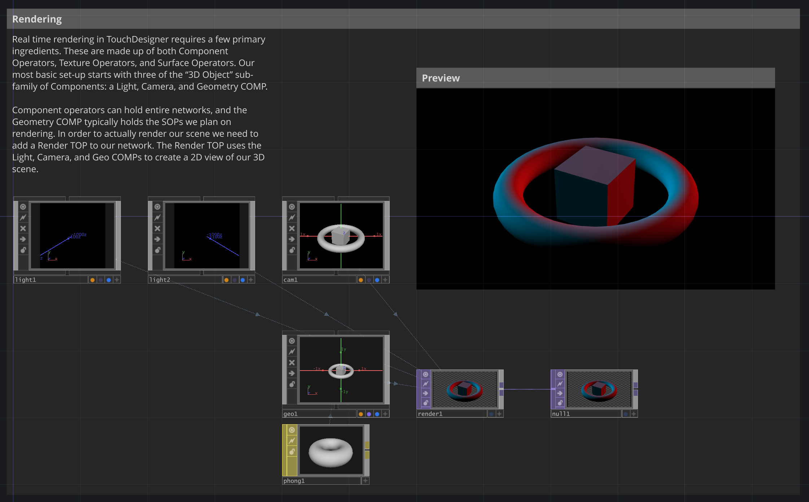

# TouchDesigner Workshop USITT 2026

## TD Details

* Workshop TouchDesigner version - 2025.32460
  * [downloads page](https://derivative.ca/download)

---

## Getting Ready

Before we begin, there are a few important things to keep in mind that will make the workshop run smoothly, and ensure you can focus on getting the most out of our time together. Below you’ll find a list of required first steps / tools to have with you, and some recommended steps to help you prepare.

### REQUIRED

Bring you Laptop – Mac or PC. Make sure you review the [System Requirements] from Derivative so you know you have a machine that’s TouchDesigner ready.
Don’t forget your power adapter – TouchDesigner is largely a GPU based environment. This makes for fast operations, but often means that your battery will get consumed quickly. You’ll definitely want your adapter, even if it’s a pain to lug around.

Download [TouchDesigner 099] – it’s very important to make sure your machine can run TouchDesigner before you get to the workshop. There are some specific graphics card requirements and making sure everything works before the first day will make sure we can get the group started right away.

Get your TouchDesigner 099 License – you can register for a Derivative account here - [Derivative Registration], and that will make sure you can create a non-commercial license key. The non-commercial license is free, and we won’t need anything more than this for our workshop.

### RECOMMENDED

A 3 Button mouse – You certainly can use a track pad while you’re working, but you’ll be much happier to have an actual mouse for working in Touch.
Download and Install a text Editor – [Visual Studio Code] is a great place to start if you don't have one.

Bring some Assets – You certainly don’t have to bring any extra assets, but it’s often nice to have more than just the stock images / videos handy.
Business Cards – the best resources you’ll find at any workshop will be the other people in the room with you. If you’ve got some extra business cards make sure you bring a stack to share with the folks in our group.

### BE INSPIRED

Take a look at some of the projects featured on the [Derivative Blog] to see what people are making and doing with TouchDesigner.

## Additional Prep

We'll be using [TouchOSC]. Make sure you download and install this application - we'll only be working locally, so you only need to install it on your laptop. While there is a paid version of this app, we will only be using the features in the free version for the workshop.

## Workshop summary

## Schedule

| Time     | Topic     |
| ---      | :---      |
| 10:00 AM | Welcome & Introduction |
| 10:15 AM | What is TouchDesigner? Project Examples |
| 10:30 AM | Navigating the Environment & OP Families |
| 11:30 AM | Working with TOPs & Video Effects |
| 12:30 PM | Working with POPs & Particles |
| 1:00 PM  | Lunch     |
| 2:00 PM  | Post Processing & Feedback |
| 2:30 PM  | Working with the Scene Builder |
| 3:00 PM  | Projection Mapping Workflows |
| 4:00 PM  | Custom Parameter UI Building & TouchOSC |
| 5:00 PM  | Wrap      |

---

# Workshop Overview

To get started, we'll look at some examples of projects that use TouchDesigner and what kind of work is possible with this tool. Then we'll focus on the basics of working with TouchDesigner: navigating the environment, the user interface, and learning about the different operator families. Then we'll jump into the world of TOPs (Texture Operators) and look at ways that we can manipulate images, video, and live inputs like a webcam. Once we've got a firm grasp of image manipulation, we'll move on to working with POP (Point Operators), which are the newest operator family.

During the workshop we'll create everything together so you have the hands on experience of building networks yourself. While that's great for working in the moment, sometimes you want (or need) an extra reference. This workshop repo contains all of the exercises we've gone over together in the workshop. This can be helpful as a reference, but also if you get stuck and need to compare you work to an example.

The first time you open any new application it can be frustrating or confusing as you try to understand how the interface works. TouchDesigner is a node based toolkit, and while it's similar to many tools, it's also distinctly unique. We'll take a little time to cover the basics of getting around the environment, and how to understand what we're seeing. Before you know it you'll be zooming around your networks like it's second nature.

> Half of learning a new tool or development environment is just figuring out where all the knobs and buttons are. In this first course we’ll focus on getting your bearings in TouchDesigner, learning the essential interface elements and controls, as well as the fundamental principles of each operator family.

Learn more at [Navigating the TouchDesigner Environment](https://learn.derivative.ca/courses/100-fundamentals/lessons/101-navigating-the-environment/)

## Operator Families

Operators are the building blocks of our TouchDesigner networks. In a typically TouchDesigner project you'll find a series of operators connected by wires into a network. These networks make up the code for your project. The operators in our networks are separated into families which also represent that kinds of data that they contain.

### TOPs

> A picture’s worth a thousand words… in TouchDesigner we work with images all the time, and the texture operator family is our primary means of manipulating pixels. From importing files to building visual FX this course will look at how we work with images and video, and how we can manipulate them in TouchDesigner.

Learn more at [Working with TOPs](https://learn.derivative.ca/courses/100-fundamentals/lessons/102-tops-working-with-images/)

### CHOPs

> Channel operators (CHOPs) are the signals and controls that bring a TouchDesigner project to life. CHOPs bring in controls from outside devices, allow us to work with Audio, build simple state machines, and animate elements in the network. This course will cover the principal aspects of the channel operator family, as well as examine use cases and mechanics that will help you build your first interactive project.

Learn more at [Working with CHOPs](https://learn.derivative.ca/courses/100-fundamentals/lessons/103-chops-working-with-signals/)

### SOPs

> With a long history in authoring 3D worlds and figures, TouchDesigner’s roots reach back to principles of non-destructive procedural geometry authoring. Surface Operators (SOPs) are the geometric and modeling primitives in the TouchDesigner environment; they’re also our introduction to the world of real time rendering and open a world of opportunities for creating both artistic and technical visual worlds

Learn more at [Working with SOPs](https://learn.derivative.ca/courses/100-fundamentals/lessons/104-sops-rendering-3d-scenes/)

### DATs

> Text, tables, and scripts – a little bit of Python can go a long way; from controlling how operators function in the network, to more complex state and preset machines. While it’s not required that you learn Python to use TouchDesigner, it does open a wide world of possibilities for expanding your projects and creativity. In this course we’ll dip our toe into the scripting waters while also learning about the flexibility and power of the text based operators in TouchDesigner.

Learn more at [Working with DATs](https://learn.derivative.ca/courses/100-fundamentals/lessons/107-dats-scripting-python/)

### COMPs

> Making something visually compelling only half the story, it’s also important to consider how you paint the world with the pixels you’ve manipulated. In this course we’ll look at the essential organization and output mechanics for displaying your work on a screen or through a projector. We’ll also look some the high level organizational capabilities in TouchDesigner, and how this can make your projects easier to navigate.

Learn more at [Working with COMPs - Network Organization](https://learn.derivative.ca/courses/100-fundamentals/lessons/105-comps-interfaces-organization-outputs/)

> In addition to building aesthetically focused elements, TouchDesigner is also used to author full UI packages for applications, exhibition pieces, and installations. In this lesson, we’ll look at the building blocks for creating interactive user interfaces, as well as how to build resolution adaptable elements.

Learn more at [Working with COMPs - Building Interfaces](https://learn.derivative.ca/courses/100-fundamentals/lessons/106-comps-interface-building-and-controls/)

### Connecting Families

While it’s great to see how we connect operators of like families together, most of the work we do with TouchDesigner often requires connecting operators of different families together. Here we’ll look at a few simple examples of how we can start building relationships between operators of different families, and how we can use these ideas to build responsive and interactive networks.

## Live Camera Video FX

There's no shortage of things you can do with TouchDesigner, and one of the fun and exciting ways to get started learning TOPs is to build video FX networks and work with live cameras. In these examples we'll look at how we can approach several different techniques for working with video - both live footage and video files. We'll look at how simple transformations can create interesting effects with only a few nodes in our network. We'll also take a closer look at the mechanics of working with texture operators, and how you can take build your own reusable effects.

## Realtime Rendering

There are lots of ways we might use real time rendering in TouchDesigner - from rendering an abstract 3D scene to data visualization. We'll cover some of the basics that you need to know when setting up your rendering pipeline so you can start creating your own 3D scenes.

> Real time rendering in TouchDesigner requires a few primary ingredients. These are made up of both Component Operators, Texture Operators, and Surface Operators. Our most basic set-up starts with a [Light](https://docs.derivative.ca/Light_COMP), [Camera](https://docs.derivative.ca/Camera_COMP), and [Geometry COMP](https://docs.derivative.ca/Geometry_COMP). Component operators can hold entire networks, and the Geometry COMP typically holds the SOPs we plan on rendering. In order to actually render our scene we need to add a [Render TOP](https://docs.derivative.ca/Render_TOP) to our network. The Render TOP uses the Light, Camera, and Geo COMPs to create a 2D view of our 3D scene.

Learn more at [TouchDesigner Basic Render Setup](https://learn.derivative.ca/courses/100-fundamentals/lessons/104-sops-rendering-3d-scenes/topic/basic-render-setup/)

## UIs, Custom Pars & Outputs

Custom parameters are an essential part of the modern TouchDesigner workflow. This feature makes it easy for us to create custom components that have their own controls without needing to build complete UIs. They also allow for a streamlined approach to creating sharable and reusable elements inside of TouchDesigner. In this section we’ll look at how to get started with using custom components.

## I/O With Touch OSC

Building interfaces for your projects is no small feat and there are lots of ways to approach this challenge. While TouchDesigner itself has a built-in UI system it's often helpful to separate your UI schema from your project. You might create a web interface with something like tools like:

* [Open Stage Control](http://openstagecontrol.ammd.net/)
* [Node Red](https://nodered.org/)
* [OSCAR](https://www.createwithoscar.com/)

If you wanted to use a dedicated app instead of something web based you might consider:

* [TouchOSC]
* [OSC/PILOT](https://oscpilot.com/)

Any of the solutions above will help you create an interface that's on a different screen or even a different computer than your TouchDesigner project's main output. For this workshop we're going to use [TouchOSC]. Full disclosure, there is both a free and paid version of this app - for this workshop we'll only be using features that are in the free version. The latest version of TouchOSC runs on Windows, macOS, Android, and iOS - which makes it easy to build an interface on your desktop and then share it to your mobile device.

**Organize as you program**

*While it can be temping to just drop another OSC in CHOP or DAT into your network wherever you need one, this is generally considered bad practice. Every operator you use has some computational overhead associated with it, so it's best to only add the operators you need. But how do you only work with one OSC in op? You use select ops. A select op can route the contents of an operator to anywhere in your network. To put this into practice, at the root of your project create a base called `base_com` or `base_io`. Put your OSC In operator in this network, and then use select Ops to pull it's contents anywhere you need them.*

### What is OSC?

> OpenSoundControl (OSC) is a data transport specification (an [encoding](https://opensoundcontrol.stanford.edu/encoding.html)) for realtime message communication among applications and hardware. OSC was developed by researchers [Matt Wright](https://ccrma.stanford.edu/matt-wright) and [Adrian Freed](http://www.adrianfreed.com/) during their time at the Center for New Music & Audio Technologies ([CNMAT](https://cnmat.berkeley.edu/)). OSC was originally designed as a highly accurate, low latency, lightweight, and flexible method of communication for use in realtime musical performance. They proposed OSC in 1997 as “[a new protocol for communication among computers, sound synthesizers, and other multimedia devices that is optimized for modern networking technology](https://opensoundcontrol.stanford.edu/publications/1997-Open-SoundControl-A-New-Protocol-for-Communicating-with-Sound-Synthesizers.html)”.

learn more at the official page for  [OSC]

**Networking Messaging**

*If you're collaborating with another artist, it can often be beneficial to use network messages to synchronize your applications. For example, if one creator is focused on audio you can still receive messages over the network to control the visual elements you've created in TouchDesigner. The same techniques we've explored using OSC messages from a control surface can also be used when sending control messages from another computer or application.*

## Packaging

Unfortunately we can’t build complete EXEs with TouchDesigner, but we can build components to share called TOX files, and we can embed files in project file (our TOE). Here we’ll look at a few of the techniques you might use when packaging up your project file either to share or save as a TOX or to build a TOE file that holds all of the assets your project needs to move to another computer.

----

# Resources

* [Learn TouchDesigner from Derivative]
* [The Interactive & Immersive HQ]
* [TouchOSC]
* [OSC]
* [Visual Studio Code]
* [Derivative Blog]
* [audioAnalysis]
* [TDAbleton]

<!-- links -->
[TouchOSC]:https://hexler.net/touchoscO
[OSC]:https://opensoundcontrol.stanford.edu/
[Learn TouchDesigner from Derivative]: https://learn.derivative.ca/
[The Interactive & Immersive HQ]:https://interactiveimmersive.io/
[System Requirements]: https://docs.derivative.ca/index.php?title=System_Requirements
[TouchDesigner 099]: https://derivative.ca/download
[Derivative Registration]: https://derivative.ca/user/register
[Visual Studio Code]: https://code.visualstudio.com/
[Derivative Blog]: https://derivative.ca/showcase
[audioAnalysis]: https://docs.derivative.ca/Palette:audioAnalysis
[TDAbleton]: https://docs.derivative.ca/TDAbleton
[Pure Data]: https://puredata.info/
[MaxMSP]: https://cycling74.com/products/max
